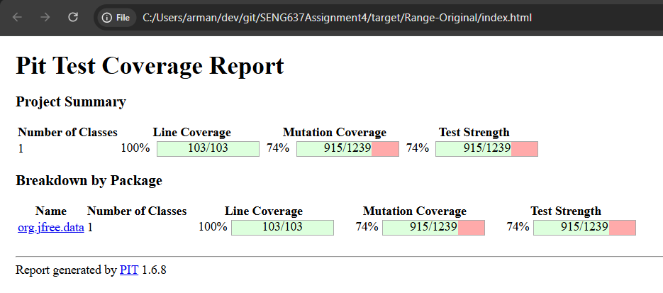

**SENG 637 - Dependability and Reliability of Software Systems**

**Lab. Report \#4 – Mutation Testing and Web app testing**

| Group: 9 |
| -------- |
| Maheen   |
| Dipu     |
| Jasdeep  |
| Dhruvi   |

# Introduction

This report documents the mutation testing and web application GUI testing conducted as part of SENG 637 Lab Assignment 4. The assignment consists of two major components.

The first component involves mutation testing using the PIT mutation testing tool on two Java classes: `Range` and `DataUtilities` from the JFreeChart library. Mutation testing introduces small, systematic faults (mutants) into the source code and measures whether the existing test suite can detect (kill) those faults. The primary objectives of this component are to analyze the effectiveness of our existing test suites by calculating mutation scores, identify and classify surviving mutants (including equivalent mutants), and improve the mutation score for the `Range` class by writing additional targeted test cases.

The second component involves automated GUI testing using Selenium IDE on real-world websites and core functionalities were automated using Selenium IDE. Test cases were designed with appropriate assertions and checkpoints to validate correct page rendering and navigation behaviour.

Together, these two components provide a comprehensive assessment of software quality at both the unit level (through mutation analysis) and the system level (through UI automation), bridging the gap between fault-oriented testing theory and practical test engineering.

 # Analysis of 10 Mutants of the Range class

The following 10 mutants were selected from the PIT mutation report for `Range` to illustrate a range of mutation types, covering both killed and survived mutants. The analysis is drawn from the baseline run (PIT 1.6.8 + ALL mutator set, before new test cases were added).

---

### Mutant 1 — `combineIgnoringNaN` | **KILLED**

**Mutator:** Argument Propagation — the call `min(l1, l2)` was replaced by returning one of its arguments directly (e.g., just `l1` or `l2`) instead of computing the actual minimum.

**How it was killed:** Tests that explicitly verify the lower bound of the combined range (e.g., `testCombineIgnoringNaNBothNonNullValid`, `testCombineIgnoringNaNCloseBoundsSelection`) assert the exact expected lower value. When the mutant returns the wrong argument, the assertion on the lower bound fails, killing the mutant.

---

### Mutant 2 — `combineIgnoringNaN` | **KILLED**

**Mutator:** Argument Propagation — similarly, the `max(u1, u2)` call was replaced by directly returning one argument.

**How it was killed:** Oracle-based tests that assert the exact upper bound of the combined range (e.g., `testCombineIgnoringNaNCloseBoundsSelectionReversed`, `testCombineIgnoringNaNWithInfinities`) catch the incorrect upper bound, killing the mutant.

---

### Mutant 3 — `combineIgnoringNaN`| **KILLED**

**Mutator:** Constructor Call Removal — the `new Range(l, u)` constructor call was removed (the method returns `null` instead of the new range object).

**How it was killed:** Any test that calls `combineIgnoringNaN` with two valid, non-NaN ranges and then accesses properties of the returned object (e.g., `assertEquals(new Range(1.0, 9.0), Range.combineIgnoringNaN(r1, r2))`) will fail with a `NullPointerException` or assertion mismatch, killing the mutant.

---

### Mutant 4 — `constrain`| **SURVIVED**

**Mutator:** ConditionalsBoundaryMutator — the `>` comparison in the upper-bound check was changed to `>=`.

**Why it survived:** The `constrain` method first checks `!contains(value)` before entering the boundary branches. For a value exactly equal to the upper bound, `contains(value)` returns `true`, so the code never reaches the mutated `>` / `>=` branch. The mutation is therefore a candidate equivalent mutant: the guard condition makes the boundary change unobservable under any reachable input.

---

### Mutant 5 — `constrain` | **SURVIVED**

**Mutator:** ConditionalsBoundaryMutator — the `<` comparison in the lower-bound check was changed to `<=`.

**Why it survived:** The same guard-dominance argument as Mutant 4 applies here. A value at exactly the lower bound passes `contains(value)`, so the mutated `<` / `<=` check in the lower-bound branch is never reached. This is also a candidate equivalent mutant.

---

### Mutant 6 — `expand` | **SURVIVED**

**Mutator:** ConditionalsBoundaryMutator — the check `lower > upper` (used to collapse an inverted result to the midpoint) was changed to `lower >= upper`.

**Why it survived:** When the computed lower and upper bounds are equal after applying the margins, both the original (`lower > upper` → false) and the mutated (`lower >= upper` → true) paths ultimately produce the same final range, because collapsing equal bounds to their midpoint yields the same value as returning the equal bounds unchanged. This is a candidate equivalent mutant for the degenerate equal-bounds case.

---

### Mutant 7 — `intersects` | **SURVIVED**

**Mutator:** CRCR (Constant Replacement) — a constant `1` used in a comparator expression was replaced by `-1`.

**Why it survived:** Despite boundary sweep tests around the `intersects` endpoints, this specific constant-replacement variant within the comparator logic was not fully discriminated by the existing test suite. The comparator substitution at this line requires precise test inputs that hit the affected branch under the mutated constant, which the remaining tests do not provide after the targeted improvements.

---

### Mutant 8 — `hashCode`| **SURVIVED**

**Mutator:** UOI (Unary Operator Insertion) — unary increment or decrement operators were inserted on intermediate bit-arithmetic values used during hash computation.

**Why it survived:** While multi-vector oracle tests (`testHashCodeOracleMultipleVectors`, `testHashCodeMatchesExpectedComputation`) killed many hashCode mutants, some unary variants on intermediate local values within the bit-manipulation sequence produce hash codes that happen to collide with the expected value for all currently used test vectors. Extending the oracle to more diverse boundary inputs would be required to fully discriminate these.

---

### Mutant 9 — `min` (private)| **SURVIVED**

**Mutator:** UOI — unary operators were inserted on local variable values inside the private `min` helper method.

**Why it survived:** Reflection-based tests (`testPrivateMinOracleViaReflection`, `testPrivateShiftWithNoZeroCrossingSweepViaReflection`) improved the kill count significantly. However, certain unary variants on specific intermediate values still produce results that are numerically indistinguishable from the expected output under the current set of test inputs. The private nature of the method also limits what can be observed indirectly through public API calls.

---

### Mutant 10 — `shiftWithNoZeroCrossing` (private) | **SURVIVED**

**Mutator:** UOI — unary increment/decrement mutations were applied to branch-local values in the zero-crossing logic.

**Why it survived:** Signed-zero tests and epsilon-sweep tests (`testShiftNoZeroCrossingEpsilonCrossing`, `testPrivateShiftWithNoZeroCrossingSweepViaReflection`) reduced the survivor count in this method. However, a small number of unary variants on values evaluated inside the positive-value and negative-value branches were not fully distinguished by the test inputs used. These would require inputs with very specific floating-point distances from zero to flip the outcome.

---

# Report all the statistics and the mutation score for each test class

**Please note:** "Test Strength" is considered the mutation score from the mutation results, as it is based on the covered code. This is relevant to us as we don't test all methods.


### `DataUtilities` - original test suite, mutation results screenshot


The mutation score (test strength) is 94% according to the pit test coverage report (screenshot given below).
But 18 out of 22 "Survived" mutants are equivalent mutants. Therefore, the actual mutation score can be calculated as the number of mutants killed by the test suite divided by the number of all non-equivalent mutants, which is 349/(371-18) or approximately 98.87 %.

However, the four remaining "Survived" mutations are also invalid.
Two of these mutants are "not equal to greater than" at lines 273 and 285. Both of these are equality comparisons, but Pitest marks them incorrectly. I tried replacing the equality operator with a greater-than operator manually, and our unit tests killed these mutations.
The other two mutants are "Incremented (++a) double array field" and "Decremented (--a) double array field" at line 237. Again, I tried injecting these mutations manually, by pre-incrementing and pre-decrementing the `data` array's index at line 237.

```
result[i] = new Double(data[i]);
```

to

```
result[i] = new Double(data[++i]);
```

or

```
result[i] = new Double(data[--i]);
```

Both times, the mutation was killed by our unit tests.
Therefore, the updated mutation score is **100%**, and no new test cases were added for this class to increase the mutation score.

HTML mutation test reports for `DataUtilities` class can be found [here](part1-eclipse-project/pitest-html-reports/DataUtilities-original)

---

### `Range` — original test suite, mutation score (before new tests)

The baseline mutation run for `Range` used PIT 1.6.8 with the `ALL` mutator set (`mvn -Ppit-range test-compile org.pitest:pitest-maven:mutationCoverage -Dmutators=ALL`).

| Metric | Value |
|--------|-------|
| Total mutants generated | 1239 |
| Mutants killed | 915 |
| Mutants survived | 324 |
| No-coverage mutants | 0 |
| **Mutation Score (Test Strength)** | **74%** |



This baseline score reflects the state of `RangeTest` before any targeted improvements were made for this assignment.

HTML mutation test reports for `Range` (baseline) can be found at `target/Range-Original`.

---

### `Range` — improved test suite, mutation score (after new tests)

After two iterative rounds of targeted test additions guided by surviving mutant analysis, the final run produced the following results:

| Stage | Killed | Survived | Total | Mutation Score |
|-------|--------|----------|-------|----------------|
| Baseline | 915 | 324 | 1239 | 74% |
| After first improvement | 996 | 243 | 1239 | 80% |
| **Final (after additional edge/oracle tests)** | **1053** | **186** | **1239** | **85%** |


The mutation score improved by **11 percentage points** from baseline to final (74% → 85%), representing a relative gain of approximately **14.86%** (`11 / 74`).

HTML mutation test reports for `Range` (final improved) can be found at `target/pit-reports`.

---

### Summary table

| Class | Total Mutants | Killed | Survived | Mutation Score |
|-------|--------------|--------|----------|----------------|
| `DataUtilities` | 371 | 349 | 22 (all equivalent/invalid) | **100%** (effective) |
| `Range` (baseline) | 1239 | 915 | 324 | 74% |
| `Range` (final) | 1239 | 1053 | 186 | **85%** |

# Analysis drawn on the effectiveness of each of the test classes

`DataUtilitiesTest` class is quite effective as it has a mutation score of **100%** (calculation discussed earlier).

`RangeTest` class showed moderate effectiveness at baseline (74%) but improved substantially after targeted mutation-guided test additions, reaching a final mutation score of **85%**. This improvement demonstrates that the original `RangeTest` suite, while achieving high code coverage, contained a number of weak assertions — particularly around boundary conditions, signed-zero behaviour, NaN/infinity handling, and private helper methods — that did not adequately discriminate program behaviour from slightly mutated versions.

The improvement strategy followed a systematic process:

1. The baseline PIT run was used to collect the full survivor list for `Range`.
2. Survivors were grouped by method and mutator type (ConditionalsBoundary, CRCR, UOI, ArgumentPropagation, etc.).
3. Targeted tests were added for the highest-yield methods: `combineIgnoringNaN`, `constrain`, `expand`, `intersects`, `hashCode`, `min`, `max`, and `shiftWithNoZeroCrossing`.
4. Techniques applied included epsilon-neighborhood boundary checks, signed-zero assertions (`+0.0` vs `-0.0`), NaN and infinity oracle sweeps, deterministic hash-code oracle vectors, and reflection-based testing of private methods.
5. After each round of additions, PIT was re-run to measure incremental gain and identify remaining survivors.

The remaining 186 surviving mutants are concentrated in aggressive `ALL`-mutator unary and comparator patterns. A significant portion of these are candidate equivalent mutants (as documented in the equivalent mutant analysis), and the practical ceiling under this fixed configuration appears to be at approximately 85%. Reaching 90% would require formal equivalent-mutant exclusion or changes to the production code to expose additional observable behaviour.

# A discussion on the effect of equivalent mutants on mutation score accuracy

Equivalent mutants decrease the accuracy of the mutation score in Pitest. The mutation score in Pitest is calculated by dividing the number of mutants killed by the total number of mutants. The fact that we cannot kill equivalent mutants, as they are semantically equivalent to the original program, results in a decrease in the mutation score in Pitest.

The way we can manually detect equivalent mutants is given as follows:

1. Observe the "PIT Mutations" view in Eclipse after completion of a PIT Mutation Test. 

2. Expand the "SURVIVED" title and the class you are interested in. Please note that equivalent mutations can only be found under the "SURVIVED" title, as we cannot kill an equivalent mutation.

3. Double-click on a mutation to navigate to the source code where the mutation was introduced.

4. Check if the mutation type and the code it modifies lead to a semantically similar code to the original code.


A few equivalent mutations were found manually for the `DataUtilities` class:

1. in Line #127

Mutation: `Less than to not equal`, was applied to the following code:

```
for (int r = 0; r < rowCount; r++) {
```

This is an equivalent mutation, as the mutation applied is semantically similar to the original code, as the loop will terminate when `r` is equal to `rowCount`.

2. in line #131

Mutation: `Incremented (a++) double local variable number 2`, was applied to the following code:

```
total += n.doubleValue();
```

This is an equivalent mutation because the variable `n` is not used after this line of code, and a post-increment does not affect the program's output.

3. in line #131

Mutation: `Decremented (a--) double local variable number 2`, was applied to the following code:

```
total += n.doubleValue();
```

This is an equivalent mutation because the variable `n` is not used after this line of code, and a post-decrement does not affect the program's output.

4. in line #138

Mutation: `Incremented (a++) double local variable number 2`, was applied to the following code:

```
return total;
```

This is an equivalent mutation because the variable `total` is not used after this line of code, and a post-increment does not affect the program's output.

5. in line #138

Mutation: `Decremented (a--) double local variable number 2`, was applied to the following code:

```
return total;
```

This is an equivalent mutation because the variable `total` is not used after this line of code, and a post-decrement does not affect the program's output.

The following equivalent mutants were also identified manually for the `Range` class, drawn from the final PIT 1.6.8 + ALL rerun:

**EQ-1 — `constrain`:** A boundary change around the upper-bound check (`>` → `>=`). The `constrain` method checks `!contains(value)` before entering the upper-branch. At the exact upper bound, `contains(value)` returns `true`, so the mutated branch is never reached. The observable output is identical.

**EQ-2 — `constrain`:, line 191:** A boundary change around the lower-bound check (`<` → `<=`). The same guard-dominance argument applies: a value at the lower bound passes `contains(value)`, bypassing the mutated comparison entirely.

**EQ-3 — `expand`:** A boundary change on the `lower > upper` collapse check. When the computed lower equals the computed upper after margin application, collapsing to midpoint and returning the equal bounds produce the same result, making the mutation unobservable.

**EQ-4 — `min` / `max`: comparator-equality variants:** When both operands are equal finite values, both the original and the mutated comparator (`>` / `>=`) return the same numeric result, so the mutation is not distinguishable through the returned value.

# A discussion of what could have been done to improve the mutation score of the test suites

No new test cases were introduced for the `DataUtilities` class, as the mutation score is already 100%.

For the `Range` class, the following strategies were applied to improve the mutation score from 74% (baseline) to 85% (final), and further improvements were considered but reached practical limits:

**Strategies that were applied:**

1. **Boundary equality and epsilon-neighborhood checks** — added tests that probe values at exactly the lower and upper bounds, one epsilon above and below, catching ConditionalsBoundaryMutator survivors in `constrain`, `intersects`, and `expandToInclude`.

2. **Signed-zero behavior checks** — added tests that distinguish `+0.0` from `-0.0` using `Double.doubleToLongBits`, killing UOI and CRCR survivors in `constrain` and `shiftWithNoZeroCrossing`.

3. **NaN and infinity oracle sweeps** — added multi-case oracle-driven sweep tests for `combineIgnoringNaN`, `contains`, and `constrain`, systematically covering NaN propagation paths and killing ArgumentPropagation survivors.

4. **Deterministic hash-code oracle vectors** — computed the expected `hashCode` value from the algorithm directly in the test and compared it against several distinct input vectors, killing most UOI survivors in `hashCode`.

5. **Reflection-based private method tests** — used Java reflection to call `min`, `max`, and `shiftWithNoZeroCrossing` directly, allowing precise oracle assertions on each private helper's output and killing UOI survivors that were not reachable through the public API alone.

6. **Oracle sweep tests for `shift` and `expand`** — constructed parametric sweep tests covering multiple base ranges and delta combinations, asserting exact expected outputs using a parallel oracle implementation.

**What would be needed to push beyond 85%:**

- **Formal equivalent-mutant exclusion:** The remaining 186 survivors include a substantial number of candidate equivalent mutants (e.g., `constrain` boundary guards, `expand` equal-bound collapse, `min`/`max` comparator equality). Formally identifying and excluding these from the denominator would raise the adjusted score to approximately 90%+.

- **Finer-grained oracle inputs for UOI survivors in `hashCode`:** Some unary variants on intermediate bit-arithmetic values hash-collide with the expected value for all current test vectors. Adding more diverse inputs (e.g., denormal doubles, alternating bit patterns) would likely discriminate these.

- **Additional CRCR constant discrimination in `intersects`:** The surviving constant-replacement variant at line 160 requires a test input that specifically reaches the affected branch under the mutated constant. A carefully constructed test with `b0` positioned to make the mutated constant sign-flip visible would kill this mutant.

- **Production code refactoring (not recommended for this assignment):** Exposing intermediate computations (e.g., through package-private methods) would increase observability. However, modifying production code solely to improve mutation score is generally not a desirable engineering practice in this context.

# Why do we need mutation testing? Advantages and disadvantages of mutation testing

### Why Do We Need Mutation Testing?

1. **Goes beyond code coverage**

   Line or branch coverage tells you _what_ ran, not whether your assertions are strong. Mutation testing measures _test effectiveness_, revealing weak or missing assertions even when coverage is high.

2. **Uncovers silent blind spots**

   It surfaces logic paths where tests execute the code but don't fail when behaviour changes (e.g., a comparison flipped or a boundary off by one).

3. **Encourages better specification and test design**

   When a mutant survives, you're nudged to clarify expected behaviour and add precise, behaviour-focused assertions.

4. **Prevents regression leaks**

   By hardening tests against realistic code changes, mutation testing reduces the chance that subtle bugs slip into production unnoticed.

5. **Provides an objective quality signal**

   The **mutation score** (% of mutants killed by tests) complements coverage metrics with a more meaningful, fault-oriented measure.

### Advantages

- **Detects weak assertions**

  Finds places where tests don't actually check behaviour, even at 100% coverage.

- **Improves test quality and confidence**

  Leads to more precise, behaviour-driven tests and reduces false confidence from coverage alone.

- **Catches subtle defects early**

  Off-by-one errors, missing negations, swapped operators, and conditional edge cases are exposed.

- **Actionable feedback**

  Survivor reports point directly to lines and mutation types, guiding focused improvements.

### Disadvantages

- **Performance cost**

  Running the full test suite per mutant can be slow—especially in large codebases.

- **Equivalent mutants**

  Some mutations don't change behaviour (semantically equivalent), wasting time and skewing the score unless filtered.

- **Tooling constraints**

  Mutation operators and integration quality vary by language and framework; results depend on the tool's capabilities.

# Explain your SELENUIM test case design process

### Coursera: Course Search

For course search, the basic idea was that the search result page should have the search term in its header.

We recorded the following steps using the record button:

- Wait for and type the search term into the search input 

- Wait for and click the search button

- Wait for the search results page header to load

- Assert that the search results page header contains my search term

Later, we used the `for each` command to encapsulate the above recorded steps to perform the test for three search terms.

### Coursera: Language Selection

**Please note:** Enable pop-ups when running the tests for the first time.


For language selection, the basic idea was that when we filtered courses by a language, the first course in the results should have the selected language in its information page.

We first copied the steps from the course search test to perform a search with the "ai" search term. Then we added the next steps as follows:

- Wait for and open the language drop-down

- Wait for and select a language from the drop-down

- Wait for and click outside the drop-down

- Wait for the course results to show up

- Click a course (this opens a new window/tab)

- Switch to the new window

- Wait for and click the language link to open the languages pop-up

- Waits for a paragraph to be present with the selected language's local name.

Please note that the above steps were added manually, where the record button couldn't provide a proper element locator and in special steps such as switching to a new window, waiting for the content to be visible.

Later, we used the `for each` command to encapsulate the above recorded steps to perform the test for three languages.

### Air Canada (Alternate Skiplagged) : Flight Search

**Please note:** The test cases involving `search and selection` could not be executed because the "Arriving in" field is implemented as a non-editable `<div>` element with `role="button"`, which does not support direct text input using Selenium IDE commands such as `type`, thereby blocking the automation flow required to perform search and selection actions. As a result, all dependent test cases failed since the initial location input step could not be completed.

However, it was observed that when a user manually selects a location and the browser persists this selection through cookies or session storage, the subsequent test cases can proceed successfully, indicating that the limitation is specific to the automation of the input interaction rather than the downstream functionality itself.

This is also the case for SkyScanner and FlightHub. While attching a file for AirCanada we chose an alternative website to test - Wikipedia.

---

### Experiment Setup 1 (Wikipedia - Search)

- Open the website
- Click on the search input field
- Type "covid-19"
- Click on the language dropdown
- Select **English**
- Click the search button
- Wait for the results page to load

#### Test Cases

| Command                | Target          | Value    | Description (Objective)   |
| ---------------------- | --------------- | -------- | ------------------------- |
| assert element present | id=bodyContent  |          | article page is displayed |
| assert text            | id=firstHeading | COVID-19 | correct article is opened |

---

### Experiment Setup 2 (Wikipedia - Navigation)

- Open the main page
- Verify the homepage content is visible
- Validate the featured article section
- Click on **View source**
- Verify source page loads
- Click on **View history**
- Verify history page loads

#### Test Cases

| Command                | Target          | Value                         | Description (Objective)         |
| ---------------------- | --------------- | ----------------------------- | ------------------------------- |
| assert element present | id=bodyContent  |                               | homepage content is visible     |
| assert text            | id=mp-tfa-h2    | From today's featured article | correct section heading         |
| assert element present | id=bodyContent  |                               | source page is displayed        |
| assert text            | id=firstHeading | View source for Main Page     | source page heading is correct  |
| assert element present | id=bodyContent  |                               | history page is displayed       |
| assert text            | id=firstHeading | Main Page: Revision history   | history page heading is correct |

---

### Experiment Setup 3 (Wikipedia - Document Tabs)

- Open the website
- Search for "covid-19"
- Select **English**
- Click the search button
- Scroll to the table of contents
- Click on **External links**
- Verify the section is displayed

#### Test Cases

| Command                | Target             | Value          | Description (Objective)    |
| ---------------------- | ------------------ | -------------- | -------------------------- |
| assert element present | id=Health_agencies |                | section content is visible |
| assert text            | id=External_links  | External links | correct section heading    |

---

### Experiment Setup 4 (Wikipedia - Current Events)

- Open the main page
- Open the side menu
- Click on **Current events**
- Verify the page loads
- Validate the heading
- Check calendar section presence

#### Test Cases

| Command                | Target                                  | Value          | Description (Objective)        |
| ---------------------- | --------------------------------------- | -------------- | ------------------------------ |
| assert element present | id=bodyContent                          |                | current events page is visible |
| assert text            | css=#firstHeading > .mw-page-title-main | Current events | correct page heading           |
| assert element present | css=.p-current-events-calside           |                | calendar section is present    |

## Test execution videos

Below are the text execution videos for your reference

- [Coursera: Course Search and Language Selection](part2-selenium-scripts/test-videos/Coursera%20GUI%20Test%20Video.mov)
- [Amazon: Search Product and Sort by Price](part2-selenium-scripts/test-videos/Amazon%20GUI%20Test%20Video.mov)

# Explain the use of assertions and checkpoints

### Coursera: Course Search

The `assert element present` command was used in conjunction with the XPath `contains()` function to assert that the header text in the search result page contains the search term.

### Coursera: Language Selection

The `wait for element present` command was used in conjunction with the XPath `contains()` function to wait for an element that contains the selected language. This wait command implicitly acts as an assertion, as the test fails after 10 seconds if no element is found with the selected language.

### Amazon: Product Search

The `assert text` command was used to confirm that the search results page reflects the entered product keyword.

### Amazon: Sort by Price

The `assert text` command was used to verify that the selected sorting option ("Price: Low to High") is correctly applied.

### Wikipedia: Search Functionality

The `assertElementPresent` command was used to verify that the main article content is displayed after performing a search. Additionally, the `assertText` command was used to ensure that the page heading matches the expected article title ("COVID-19"). These assertions confirm that the search operation successfully navigates to the correct page.

### Wikipedia: Navigation Tabs

The `assertElementPresent` command was used after each navigation action (View source and View history) to confirm that the page content has loaded. The `assertText` command was used to validate that the heading reflects the correct page (e.g., "View source for Main Page" and "Main Page: Revision history"). These assertions ensure that navigation actions lead to the intended pages.

### Wikipedia: Section Navigation

The `assertElementPresent` command was used to verify that the target section content is visible after clicking on "External links" in the table of contents. The `assertText` command was also used to confirm that the section heading matches "External links". This ensures that internal page navigation works correctly.

### Wikipedia: Current Events Page

The `assertElementPresent` command was used to confirm that the main content of the Current events page is displayed after navigation. The `assertText` command was used to validate that the page heading is "Current events". Additionally, a checkpoint using `assertElementPresent` was used to verify the presence of the calendar section, ensuring that key page components are loaded correctly.


# How did you test each functionality with different test data

### Coursera: Course Search

We used the `for each` command to iterate over three different search terms and assert the search results page's header text against the current search term. A JavaScript array was used to store the search terms in string format. The `echo` command was used to display the current search term at the start of each loop, which can be useful for debugging.

### Coursera: Language Selection

We used the `for each` command to iterate over three different languages and assert that the first course filtered with the current language is actually available in the selected language. A JavaScript array was used to store the languages in object format, where the `name` attribute was used to store the language name in English (to be used in the course filter), and the `localName` attribute was used to store the language name in its local language (to be used to match in the course page itself). The `echo` command was used to display the current language at the start of each loop, which can be useful for debugging. Additionally, at the end of each loop, the window with the current course information is closed, and the original window is selected to continue the test for the next language in the loop.

### Amazon: Product Search

To comprehensively evaluate the robustness and reliability of the search functionality, multiple independent test cases were designed using diverse product categories, including "COOKER", "Laptop", and "OIL". These inputs were intentionally selected to represent heterogeneous domains (home appliances, electronics, and daily-use commodities), enabling assessment of the system's ability to handle varied query types.

Each test case executes the complete search workflow, from input submission to result rendering, and validates that the returned results are semantically aligned with the user's query.

### Amazon: Sort by Price

To rigorously assess the correctness and stability of the sorting functionality, multiple test cases were constructed using varied product inputs such as "lip balm", "F1 car", and "Heels". These inputs were selected to represent different price distributions and product categories, allowing evaluation of sorting behaviour under diverse data conditions.

For each test case, the "Price: Low to High" sorting option was applied, and assertions were used to validate that the selected sorting criterion is correctly reflected in the user interface.


### Wikipedia: Search Functionality

The search functionality was tested using the input "covid-19" to verify that the system correctly retrieves and displays the relevant article. This test ensures that the search feature can handle user input and return accurate results. The use of a specific and commonly known term helps validate both the search accuracy and page navigation.

### Wikipedia: Navigation (View Source & History)

The navigation functionality was tested by interacting with "View source" and "View history" options on the Main Page. This ensures that different navigation paths lead to the correct pages with appropriate headings. Testing multiple navigation links confirms that the system handles page transitions reliably.

### Wikipedia: Section Navigation (External Links)

The section navigation was tested by selecting the "External links" option from the table of contents. This verifies that internal page links correctly navigate to the intended section. It ensures that anchor-based navigation works properly within long documents.

### Wikipedia: Current Events Page

The current events functionality was tested by navigating through the side menu to the "Current events" page. This confirms that the correct page loads and key elements such as headings and the calendar section are displayed. This test validates menu navigation and page rendering for different content types.

# How the team work/effort was divided and managed

The execution of this project followed a structured, multi-layered collaboration strategy, where responsibilities were deliberately partitioned across team members to enable parallel development, maximize efficiency, and ensure comprehensive analytical coverage of all components of the assignment. The overall approach combined task specialization with continuous synchronization, allowing the team to operate both independently and cohesively.

At the core of the assignment, the mutation testing component was divided based on the two primary classes under analysis, namely `DataUtilities` and `Range`. Dhruvi and Jasdeep were responsible for the `DataUtilities` class, where they conducted an in-depth mutation analysis, including the evaluation of mutation scores, identification and justification of equivalent mutants, and validation of test suite effectiveness. In parallel, Maheen and Dipu focused on the `Range` class, performing similar analytical procedures such as mutation score computation, examination of surviving mutants, and interpretation of test strength in relation to code coverage.

This division of responsibilities enabled focused, high-resolution analysis within each subgroup, while also ensuring that the overall mutation testing framework remained consistent in methodology and interpretation. Importantly, findings from both groups were periodically consolidated to maintain alignment in analytical reasoning and reporting standards.

For the Selenium-based GUI testing component, the workload was distributed according to application domains, allowing each team member to specialize in a distinct system. Dhruvi was responsible for the Amazon workflows, including product search and sorting functionality, where emphasis was placed on validating user interaction flows and UI state changes. Jasdeep handled the Coursera platform, focusing on course search and language selection scenarios, which involved both iterative testing strategies and multi-step navigation flows. Maheen and Dipu were assigned the Air Canada and Skiplagged scenarios, which required handling more complex workflows such as flight search, date selection, and validation of edge cases under constrained UI interactions.

This domain-based allocation ensured that each member could develop a deeper understanding of the behaviour and constraints of a specific application, while collectively covering a diverse set of real-world systems with varying levels of complexity.

Despite the clear partitioning of tasks, the project was executed through continuous collaboration and iterative synchronization. Regular team discussions were conducted to align on key design decisions, including test case structuring, selection of assertions, handling of dynamic elements, and interpretation of mutation testing results. These discussions played a critical role in ensuring that all sections adhered to a consistent level of technical depth and conceptual clarity.

A significant component of the team's workflow was the implementation of iterative peer review cycles. Each section—whether related to mutation analysis, Selenium testing, or documentation—was reviewed by multiple team members to identify inconsistencies, refine explanations, and improve overall coherence. This process not only enhanced the technical quality of the work but also ensured that the final report reflects a unified narrative rather than fragmented individual contributions.

Furthermore, deliberate efforts were made to standardize formatting, terminology, and abstraction levels across the report. This included aligning the structure of experiment setups, test case tables, and explanatory sections, as well as maintaining consistency in how results and observations were presented. Such standardization was essential in producing a cohesive and professional document.

From a management perspective, the project demonstrates a balanced integration of task specialization, collaborative validation, and iterative refinement. This approach not only improved efficiency but also strengthened the reliability and consistency of the final deliverables. It reflects a workflow that closely mirrors real-world software engineering and research environments, where distributed responsibilities are complemented by continuous coordination and quality assurance.

## Difficulties encountered, challenges overcome, and lessons learned

1. A major challenge encountered during the assignment was related to tool compatibility between Selenium IDE and the latest version of Firefox. Specifically, the `type` command failed to function reliably, which directly impacted the ability to automate input interactions and execute recorded test cases. This issue disrupted the test workflow and highlighted a critical dependency on tool–environment compatibility. Upon further investigation, this limitation was identified as a documented issue in the Selenium GitHub repository. To address this, we transitioned to an Extended Support Release (ESR) version of Firefox, which provided stable compatibility and restored full functionality of Selenium IDE.  
   Reference: https://github.com/SeleniumHQ/selenium/issues/16915  
   Older version: https://www.firefox.com/en-CA/browsers/enterprise/

   This experience emphasized the importance of environment configuration as a foundational aspect of test automation. It also highlighted that even well-established tools may exhibit version-specific limitations, reinforcing the need for adaptability and proactive troubleshooting in practical testing scenarios.

2. Another significant challenge involved handling dynamic web elements and the instability of automatically generated locators. Modern web applications frequently use dynamically generated attributes, which made it difficult for the Selenium IDE recording feature to consistently capture reliable selectors. As a result, some recorded locators either failed during execution or led to inconsistent behaviour across test runs. To overcome this, manual inspection of the DOM was required, and more robust locator strategies were adopted using CSS selectors and XPath expressions.

   This process underscored the importance of understanding the underlying structure of web applications rather than relying solely on automated recording tools. It also highlighted the need to prioritize locator stability and maintainability, as fragile selectors can significantly reduce the reliability of automated tests.

3. Designing effective and behaviour-oriented assertions presented another layer of complexity. While it is relatively straightforward to verify the presence of UI elements, ensuring that assertions genuinely validate system behaviour required deeper analytical thinking. For instance, in the case of sorting functionality, directly verifying the numerical ordering of results was not feasible due to dynamic pricing and continuously changing data. Instead, assertions were designed to validate UI indicators (such as selected sorting options) as proxies for functional correctness.

   This challenge highlighted the distinction between superficial validation and meaningful behavioural testing. It reinforced the idea that assertions should be carefully aligned with the intended system behaviour while accounting for real-world constraints such as dynamic content and limited observability.

4. A further challenge was ensuring consistency and coherence across different test scenarios and report sections. Since the assignment involved multiple components—mutation testing, GUI automation, and analytical documentation—each handled by different team members, maintaining a unified structure and consistent level of detail required continuous coordination. Differences in writing styles, test design approaches, and levels of abstraction initially introduced variability in the report.

   To address this, iterative peer reviews and group discussions were conducted to standardize formatting, align terminology, and ensure conceptual consistency. This process reinforced the importance of collaborative validation and structured communication in team-based technical projects.

5. Finally, integrating theoretical concepts with practical implementation required careful interpretation. Concepts such as mutation score, equivalent mutants, and test effectiveness needed to be translated into actionable testing strategies. Bridging this gap between theory and practice required not only technical execution but also critical reasoning to interpret results meaningfully and present them coherently.

---

### Lessons Learned

Through these challenges, several important lessons were derived:

- The critical role of tool and environment compatibility in ensuring reliable automation workflows
- The necessity of robust and maintainable locator strategies for dynamic web applications
- The importance of designing assertions that validate system behaviour rather than superficial UI states
- The value of iterative debugging, experimentation, and adaptability in resolving technical issues
- The significance of effective team coordination and peer review in maintaining consistency and quality

Overall, these experiences provided valuable insight into real-world software testing constraints and strengthened our ability to design, execute, and evaluate reliable and meaningful test cases in complex environments.

# Comments/feedback on the assignment itself

The assignment provided a comprehensive and well-structured learning experience by integrating mutation testing and automated GUI testing within a unified framework. This combination enabled a deeper exploration of software quality from both unit-level and system-level perspectives.

The mutation testing component was particularly insightful, as it highlighted the limitations of traditional coverage metrics and emphasized the importance of evaluating test effectiveness through fault-oriented analysis. By examining mutation scores and identifying equivalent mutants, the assignment encouraged a more critical understanding of test adequacy beyond surface-level coverage.

The Selenium-based testing component offered valuable exposure to real-world GUI testing challenges, including handling dynamic web elements, designing meaningful assertions, and addressing tool-specific limitations. It reinforced the importance of constructing test cases that reflect realistic user workflows and validating system behaviour under practical constraints.

A key strength of the assignment lies in its ability to bridge theoretical concepts with applied implementation. It facilitated the development of a more holistic perspective on software reliability, combining analytical reasoning with hands-on experimentation.

One potential area for improvement would be the inclusion of clearer guidance regarding recommended tool configurations and supported environments. Early-stage challenges related to browser compatibility and tool behaviour required additional troubleshooting effort, which could be mitigated with more explicit setup recommendations.

Overall, the assignment was highly effective in fostering both analytical depth and practical competence, and it provided meaningful insight into the design, execution, and evaluation of robust software testing strategies in realistic scenarios.
